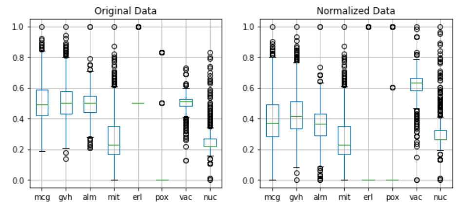
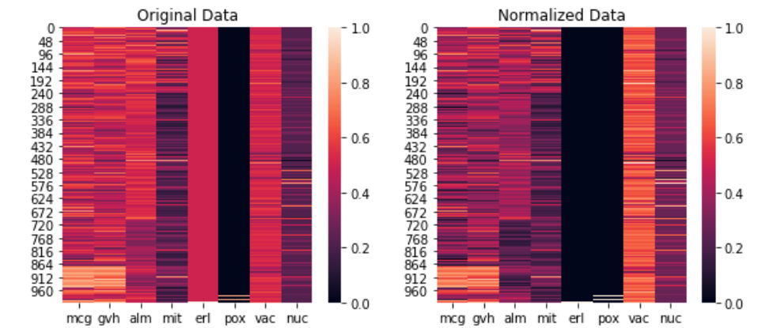
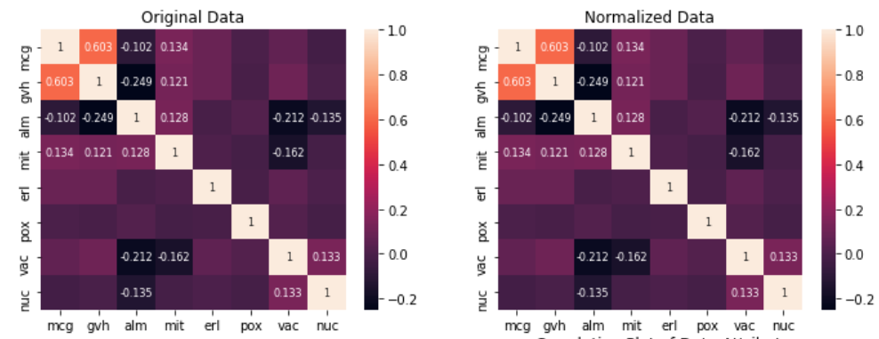

# Yeast-OCC
One Class Classifier for detecting positive cases while just trained on negative cases.

## Dataset

The Yeast dataset is obtained from [KEEL data repository](https://sci2s.ugr.es/keel/datasets.php). his dataset contains 1004 number of instances and 8 numeric attributes. The last attribute is the class variable with two values `positive` and `negative`.

## Task 

Building classifier(s) on the Yeast dataset that can identify the classes `positive` and `negative` with high performance. The training data has only “negative class”, while testing data has both the classes; `negative` and `positive`.

## Method

Three different methods have been applied on the data `One Class SVM`, `Isolation Forest`, and `Elliptic Envelope`.

## Data Attribute Plots (boxplot, heatmap, and correlation)

### Box Plot

### Heat Map

### Correlation Matrix

